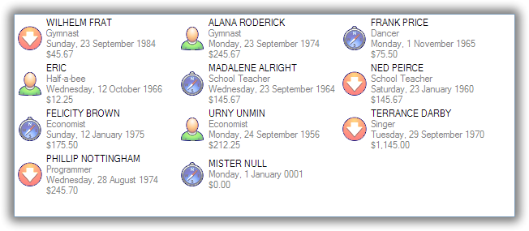
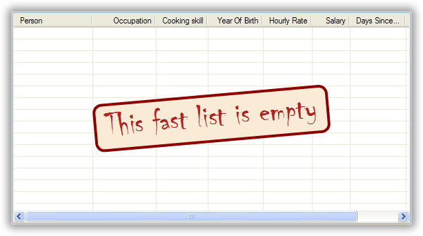
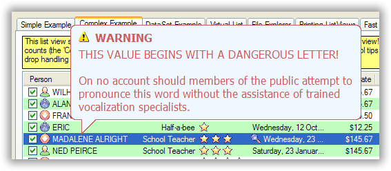
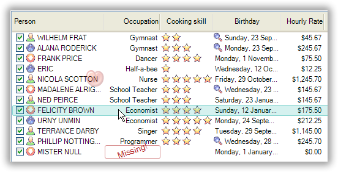
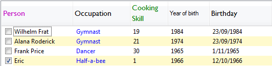
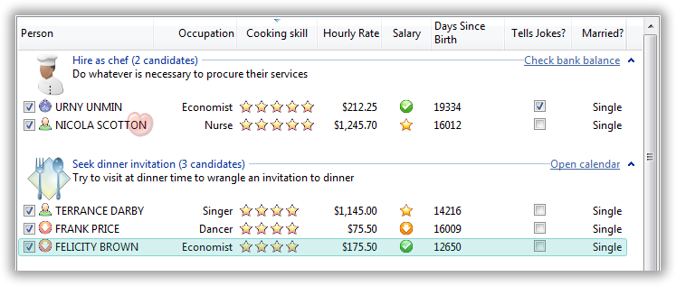

.. -*- coding: UTF-8 -*-

:Subtitle: (G)-rated techniques for loving the ListView

.. _cookbook-label:
.. _cookbook:

Learning to cook
================

.. contents::
   :depth: 1
   :backlinks: none
   :local:

.. _recipe-flavour:

1. What flavour of ObjectListView do I want to use?
---------------------------------------------------

There are five flavours of ObjectListView:

ObjectListView - Plain Vanilla
^^^^^^^^^^^^^^^^^^^^^^^^^^^^^^

*Stock standard, but still very nice*

A normal `ObjectListView` is capable of anything a `ListView` can do -- only in a much
easier to use package. Though it will handle a large number of rows, it is better
suited for smaller lists, that is, about 1000 rows or less.

If in doubt, start with this flavour. You can always change it to one of the others later on.

DataListView - Strawberry Smoothie
^^^^^^^^^^^^^^^^^^^^^^^^^^^^^^^^^^

*Everything is just smooth and easy*

A `DataListView` is for the ultra-slothful: those who literally do not want to even write one line of code.

A `DataListView` can be given a `DataSource` from within the IDE, and it will
automatically keep itself sync with that `DataSource`. Further, if the
`DataListView` is marked as editable, edits will be automatically written into the
`DataSource`.

VirtualObjectListView - Expresso
^^^^^^^^^^^^^^^^^^^^^^^^^^^^^^^^

*Has a slight bitter taste, but makes you capable of anything*

When you want to knock your users out with 10 million search results, a
`VirtualObjectListView` is for you. It can handle any number of objects.

But it does so at a cost:

* You have to implement the `IVirtualListDataSource` interface.
* It cannot use *Tile* view.
* It cannot display animated GIFs
* It cannot show groups (but if you are running on Vista and don't mind
  doing some work, see :ref:`recipe-virtualgroups`)

But for the cost of this "bitterness," you really can do anything.

FastObjectListView - Red Bull
^^^^^^^^^^^^^^^^^^^^^^^^^^^^^

.. image:: images/redbull.jpg
    :class: left-padded

*Also makes you capable of anything, but without the bitterness*

When you want speed, speed, and more speed, but you don't want the bitterness of
the `VirtualObjectListView`, a `FastObjectListView` is your weapon of choice. It
operates just like a normal `ObjectListView` -- only much faster.

It does have two limitations:

* It also cannot use *Tile* view
* It cannot show animated GIFs

But apart from that it operates just like a normal `ObjectListView`.

Did I mention the speed?

TreeListView - Kaffa Lime Leaf
^^^^^^^^^^^^^^^^^^^^^^^^^^^^^^

*Adds a distinctive flavour*

If you have a tree structured data model, and you want to show common
information about the branches and the leaves of the structure, a `TreeListView`
is at your disposal.

See :ref:`recipe-treelistview` for more information.

.. _recipe-editing:

2. How do I let the user edit the values shown in the list?
-----------------------------------------------------------

This really needs a page to itself: :ref:`Cell Editing in an ObjectListView <cell-editing-label>`

.. _recipe-sorting:

3. How can I do some fancy sorting?
-----------------------------------

There are a couple of ways to change the standard sorting behavior:

* You can listen for the `BeforeSorting` event, do whatever sorting you like, and then set
  `Handled` to  *true* on the event so that no standard sorting is done. If you want
  to prevent sorting, you can set `Canceled` to  *true*.

* If you are using an `ObjectListView` or a `DataListView`, you can install a
  `CustomSorter` delegate.

* If you are using a `VirtualObjectListView` (or one of its subclasses
  `FastObjectListView` or `TreeListView`), you cannot use the `CustomSorter`. You have
  to implement the `SortObjects()` method of the `IVirtualListDataSource`.

The `CustomSorter` delegates needs a little further explanation. This delegate
must install a `ListViewItemSorter` on the `ObjectListView`. This installed item
sorter will actually do the work of sorting the `ListViewItems`. See
`ColumnComparer` in the code for an example of what an item sorter has to do.

NOTE: This delegate does not sort the model objects themselves. Remember this
control knows nothing about your model objects, so sorting them makes no
difference to the control. You have to install the `ListViewItemSorter`.

So if you were using a normal `ObjectListView` to show a collection of medical
incidents, and you wanted to sort them so that the emergencies were always shown
first, you could install a delegate like this::

    this.incidentListView.CustomSorter = delegate(OLVColumn column, SortOrder order) {
        this.incidentListView.ListViewItemSorter = new ColumnComparer(
                this.isEmergencyColumn, SortOrder.Descending, column, order);
    };

This says, sort the items by the value in the "Is Emergency?" column first, and
secondarily by the column that the user just clicked on. Remember that the
`OLVColumn` given to the `ColumnComparer` does not have to an active column in the
control. You can create one just for the custom sorter. So, even if there was no
"Is Emergency?" column, you could still sort by the incidents so that
emergencies were shown first::

    this.incidentListView.CustomSorter = delegate(OLVColumn column, SortOrder order) {
        this.incidentListView.ListViewItemSorter = new ColumnComparer(
                new OLVColumn("ignored", "IsEmergency"), SortOrder.Descending, column, order);
    };

And if you were using a `VirtualObjectListView` to show a collection of 10 million
mailing addresses, and you wanted to sort them in some fashion, you would
implement the `SortObjects()` method of the `IVirtualListDataSource` like this::

    class MyMailingAddressesDataSource : AbstractVirtualListDataSource
    {
        ...
        override public void SortObjects(OLVColumn column, SortOrder order) {
            SortMailingAddressBy(column.AspectName, order);
        };
    };

No CustomSorter on FastObjectListView
^^^^^^^^^^^^^^^^^^^^^^^^^^^^^^^^^^^^^

One incompatibility between v1.x and v2.0 is that `FastObjectListViews` can no
longer have a `CustomSorter`. In v1.x it was possible, if tricky, to get a
`CustomSorter` to work with a `FastObjectListView`, but that is no longer possible
in v2.0 In v2.0, if you want to custom sort a `FastObjectListView`, you will have
to subclass `FastObjectListDataSource` and override the `SortObjects()` method, then
install that customized data source into your `FastObjectListView`::

    class MyCustomSortingDataSource : FastVirtualListDataSource
    {
        override public void SortObjects(OLVColumn column, SortOrder order) {
            // do some amazing sorting here
            this.RebuildIndexMap(); // you must call this otherwise the control will not work properly
        };
    };
    ...
    this.myFastObjectListView.DataSource = new MyCustomSortingDataSource(this.myFastObjectListView);

.. _recipe-ownerdrawn:

4. How can I draw the values in the cell's myself?
--------------------------------------------------

This needs a page to itself as well: :ref:`How to owner draw my values <owner-draw-label>`?

.. _recipe-column-width:

5. How can I stop the user from making a column too narrow or too wide?
-----------------------------------------------------------------------

Columns have both `MinimumWidth` and `MaximumWidth` properties. By default, these are -1,
which means that no limit is enforced. But if they are set to some other value, the column
will be limited to the given minimum or maximum width.

For example, this::

    this.titleColumn.MinimumWidth = 30

will stop the "Title" column from becoming less than 30 pixels in width. This is useful
for preventing users from shrinking columns to 0 width and then not being about to find
them again.

.. _recipe-fixed-column:

6. How can I stop the user from resizing a column?
--------------------------------------------------

There are some columns just don't make sense to be resizable. A column that
always shows a 16x16 status icon makes no sense to be resizable. To make a
column be fixed width and unresizable by the user, simply set both `MinimumWidth`
and `MaximumWidth` to be the same value.

.. _recipe-column-filling:

7. How can I make a column get bigger when the ObjectListView is made bigger?
-----------------------------------------------------------------------------

On most columns, the column's width is static, meaning that it doesn't change by
itself. But sometimes it would be useful if a column would resize itself to show
more (or less) of itself when the user changed the size of the ListView. For
example, the rightmost column of a personnel list might display "Comments" about
that person. When the window was made larger, it would be nice if that column
automatically expanded to show more of the comments about that person. You can
make this happen by setting the `IsSpaceFilling` property to  *true* on that column.

An `ObjectListView` can have more than one space filling column, and they
generally share the available space equally between them (see the
`FreeSpaceProportion` property to change this).

You should be aware that as the `ObjectListView` becomes smaller, the space
filling columns will become smaller too, until they eventually disappear (have
zero width). The `MinimumWidth` and `MaximumWidth` properties still work for space
filling columns. So you can use the `MinimumWidth` property to make sure that a
space filling column doesn't disappear.

.. _recipe-formatter:

8. How can I change the colours of a row?
-----------------------------------------

v2.3 and later
^^^^^^^^^^^^^^

You listen for `FormatRow` event. To show customers in red when they owe money,
you would set up a handler for the `FormatRow` event in the IDE, and then do
something like this::

    private void olv1_FormatRow(object sender, FormatRowEventArgs e) {
        Customer customer = (Customer)e.Model;
        if (customer.Credit < 0)
            e.Item.ForeColor = Color.Red;
    }

To change the formatting of an individual cell, you need to set
`UseCellFormatEvents` to *true* and then listen for `FormatCell` events.
To show just the credit balance in red, you could do something like this::

    private void olv1_FormatCell(object sender, FormatCellEventArgs e) {
        if (e.ColumnIndex == this.creditBalanceColumn.Index) {
            Customer customer = (Customer)e.Model;
            if (customer.Credit < 0)
                e.SubItem.ForeColor = Color.Red;
        }
    }

Unlike `RowFormatters`, these events do know where the row is going to
appear in the control, so the `DisplayIndex` property of the event
can be used for more sophisticated alternate background color schemes.
The `DisplayIndex` is correct even when the list is showing groups and
when the listview is virtual.

Another improvement over `RowFormatters` is that these events play well
with `UseAlternateBackColors`. Any formatting you do in these events takes
precedence over the alternate backcolors.

To improve performance, `FormatCell` events are only fired when the `FormatRow`
event sets `UseCellFormatEvents` to true. If you want to have a `FormatCell`
event fired for every cell, you can set `UseCellFormatEvents` on the
`ObjectListView` itself.

v2.2.1 and earlier
^^^^^^^^^^^^^^^^^^

You install a `RowFormatter` delegate. A `RowFormatter` delegate is called after a
`OLVListItem` has been completely filled in, but before it is added to the
`ObjectListView`. It can change the formatting of the list item, or any of its
other properties.

To show customers in red when they owe money, you could do this::

    this.customerListView.RowFormatter = delegate(OLVListItem olvi) {
        Customer customer = (Customer)olvi.RowObject;
        if (customer.Credit < 0)
            olvi.ForeColor = Color.Red;
    };

You can format sub-items too, but it is a little more involved. There is no
separated callback for individual sub-items. So the `RowFormatter` can be written
to format sub-items too.

So, if in our above example, we only want to make the actual credit balance to
be red, not the whole row, the `RowFormatter` would look like this::

    this.customerListView.RowFormatter = delegate(OLVListItem olvi) {
        Customer customer = (Customer)olvi.RowObject;
        if (customer.Credit < 0) {
            int i = this.customerListView.Columns.IndexOf(this.creditColumn);
            if (i >= 0) {
               olvi.UseItemStyleForSubItems = false;
               olvi.SubItems[i].ForeColor = Color.Red;
            }
        }
    };

This code doesn't assume a position for the credit column but finds it each
time. This is conservative and it could be replaced with a constant -- if you
can guarantee that no other fool is going to move or remove it :-)

Also pay attention to *olvi.UseItemStyleForSubItems = false*.
By default, all subitems have the same formatting as the listitem itself. To
indicate that you want subitems have their own formatting, you must set
`UseItemStyleForSubItems` to *false*.

One important thing to know about `RowFormatters` is that they are called
before the row is added to the control. This means that many of the properties
of the `OLVListItem` object do not yet have sensible values. For example, you
cannot use the `Index` property to try and figure out where the item is in
the control, because the item doesn't yet belong to any control.

One final thing: `UseAlternateBackColors` and `RowFormatters` that change the
`BackColor` of rows do not play well together. The `UseAlternateBackColors` assumes
that it owns the background color, and it will override any setting made by
a `RowFormatter.`

.. _recipe-listviewprinter:

9. How can I make my ObjectListView into a shiny report?
--------------------------------------------------------

You make a `ListViewReporter` object in your IDE, and you set the `ListView`
property to be the `ObjectListView` you want to print.

There is a whole article available on CodeProject explaining in detail how to do
this: `Turning a ListView into a nice report`_. Read the article and play with demo
to see how it works. However don't use the code from that article -- it is defunct.
The `ListViewReporter` code in ObjectListView project is up-to-date.

.. _Turning a ListView into a nice report: http://www.codeproject.com/KB/miscctrl/ListViewPrinter.aspx

.. _recipe-checkbox:

10. How do I use checkboxes in my ObjectListView?
-------------------------------------------------

To uses checkboxes with an ObjectListView, you must set the `CheckBoxes`
property to  *true*. If you want the user to be able to give check boxes the
*Indeterminate* value, you should set the `TriStateCheckBoxes` property to
*true*.

To make the checkboxes work, you can do:

1. Do nothing else

With just `CheckBoxes` set to  *true*, the check boxes act as a more durable
form of selection. You can find the objects that are checked via the
`CheckObjects` property, and you can change which rows are checked by setting
the same property.

2. Using CheckedAspectName

If your check box reflects data from your model, `CheckedAspectName` is the next
possibility.

Specifically, if your model object already has a property that directly matches
whether or not a row should be checked, a `CheckedAspectName` is the simplest
approach. Simply set the `CheckedAspectName` to the name of your property, and
the `ObjectListView` will handle everything else, both the getting and the
setting of this property's value. The property must be of type `bool` (or of type
`bool?` if you want to use tri-state).

3. Using delegates

If `CheckedAspectName` is too simple for your needs, you can install
`CheckStateGetter` and `CheckStatePutter` delegates. The first delegate is used to
decide if the checkbox on the row that is showing the given model object should
be checked or unchecked. The second is called when the user clicked the check
box.

There are two flavour of check state getter/putters: there are `CheckStateGetter`
and `CheckStatePutter` delegates which deal with `CheckStates`; and there are
`BooleanCheckStateGetter` and `BooleanCheckStatePutter` delegates which deal only
with `booleans`. If you are only interested in checkboxes being on or off, the
boolean versions are what you want. However, if you want to deal with
indeterminate values too, you must use the `CheckState` versions::

    this.objectListView1.BooleanCheckStateGetter = delegate(Object rowObject) {
        return ((Person)rowObject).IsActive;
    };

    this.objectListView1.BooleanCheckStatePutter = delegate(Object rowObject, bool newValue) {
        ((Person)rowObject).IsActive = newValue;
        return newValue; // return the value that you want the control to use
    };

Note that the `CheckStatePutter` returns the value that will actually be used.
This doesn't have to be the same as the value that was given. So your delegate
can refuse to accept the checking of a particular model if it wants.

Sub-item checkboxes
^^^^^^^^^^^^^^^^^^^

As of v2.1, `ObjectListViews` support a limited form of checkboxes on subitems.
The `ObjectListView` can draw a checkbox in a cell, but not the text to the right of the box.
To enable this, `UseSubItemCheckBoxes` must be set to true.

If `CheckBoxes` is True on a column, the aspect for that column will be
interpreted as a boolean value and a check box will be displayed to represent
that value. If the `ObjectListView` is owner drawn, the check box will be aligned
following the column `Alignment`, but in standard mode, the check box will always
be to the far left.

If `TriStateCheckBoxes` is True, the user will be able to set the check box to have
the `Indeterminate` value.

If you use tri state checkboxes on subitems, your model must be able to handle the third
state. This means your data must be either a `bool?` or a `CheckState`. If you have a simple
boolean field, setting `TriStateCheckBoxes` is pointless since your data cannot handle
the Indeterminate state (*null* in this case).

Setting either `CheckBoxes` or `TriStateCheckBoxes` on column 0 does nothing since
the check box on column 0 is the checkbox for the whole row. It is controlled by
settings on the `ObjectListView` itself.

CheckBoxes and virtual lists
^^^^^^^^^^^^^^^^^^^^^^^^^^^^

The .NET `ListView` cannot have `CheckBoxes` cannot on virtual lists. But, as of
v1.13 (July 2008), `VirtualObjectListView` (and thus
`FastObjectListView` and `TreeListView`) can support checkboxes. So now all
flavours of `ObjectListView` support checkboxes equally.

The only caveat for using check boxes on virtual lists is that, when a
`CheckStateGetter` is installed, the control has to iterate the entire list when
the `CheckedObjects` property is read. Without a `CheckStateGetter`, the control
assumes that nothing is checked until the user (or the programmer) explicitly
checks it. So it knows which objects have been checked and can simply return
them as the value of the `CheckedObjects` property. But when a `CheckStateGetter` is
installed, the only way the control can know whether an object is checked is by
calling the `CheckStateGetter` delegate. So to return the value of `CheckedObjects`
property, the control must iterate the whole list, asking in turn if this object
is checked. This is fine if the list has only 100 or even 1000 objects, but if
the list has 10,000,000 objects, your program is going to hang.

.. _recipe-tileview:

11. How do change the information that's displayed in Tile view?
----------------------------------------------------------------

The information that is shown when in Tile view is customisable. The primary
column has to appear, but the other "rows" are configurable. In the example
below, the Person's name appears, since that is the primary column, but the
"Occupation", "Birthdate", and "Hourly Rate" pieces of information are shown as
well.

To do this, set `IsTileViewColumn` to  *true* for those columns that you want to
appear in the Tile view. Confusingly, a column in Detail view becomes a "row" in
a Tile view.

If you really want to change the information in the Tile view, you can custom
draw it! To do this, install an `ItemRenderer` on the list and
set `OwnerDraw` to  *true*. See `BusinessCardRenderer` in the demo project for an
example implementation. To see that renderer in action, run the demo, switch to
the "Complex" tab, click the "Owner Drawn" checkbox, and switch to Tile view.

.. _recipe-emptymsg:

12. How do I change the message that's shown when the ObjectListView is empty?
------------------------------------------------------------------------------

When an `ObjectListView` is empty, it can display a "this list is empty" type message.

The `EmptyListMsg` is the property that holds the string that appears when an
`ObjectListView` is empty. This string is rendered using the `EmptyListMsgFont`::

    this.objectListView1.EmptyListMsg = "This database has no rows";
    this.objectListView1.EmptyListMsgFont = new Font("Tahoma", 24);

The empty msg list is actually implemented as an overlay. You can access that overlay
though the `EmptyListMsgOverlay` property. By default, this is a `TextOverlay` that
you can customise to your hearts content::

    TextOverlay textOverlay = this.objectListView1.EmptyListMsgOverlay as TextOverlay;
    textOverlay.TextColor = Color.Firebrick;
    textOverlay.BackColor = Color.AntiqueWhite;
    textOverlay.BorderColor = Color.DarkRed;
    textOverlay.BorderWidth = 4.0f;
    textOverlay.Font = new Font("Chiller", 36);
    textOverlay.Rotation = -5;

gives this:

If you really want to, you can set the `EmptyListMsgOverlay` property to an
object that implement the `IOverlay` interface, and then draw whatever you want
to.

.. _recipe-images-from-db:

13. On the rows of my ObjectListView, I want to show images that come from a database. How do I do that?
--------------------------------------------------------------------------------------------------------

Normally, images that are shown on rows come from an `ImageList`. The `ImageGetter`
delegate simply returns the index of the image that should be drawn against the
cell. However, sometimes, the images that should be drawn are not known at
compile time. Or they are generated dynamically from some characteristic of the
model object being displayed. In such cases, the `ImageList` cannot be pre-
populated with the images to be used. But with a little planning, you can still
use your `ImageList` to manage your images, even when the `Images` are dynamically
retrieved.

First, give your `ObjectListView` an empty `SmallImageList` and an empty `LargeImageList`.

Secondly, install an `ImageGetter` delegate on your primary column that does something like this::

    this.mainColumn.ImageGetter = delegate(object row) {
        String key = this.GetImageKey(row);
        if (!this.listView.LargeImageList.Images.ContainsKey(key)) {
            Image smallImage = this.GetSmallImageFromStorage(key);
            Image largeImage = this.GetLargeImageFromStorage(key);
            this.listView.SmallImageList.Images.Add(key, smallImage);
            this.listView.LargeImageList.Images.Add(key, largeImage);
        }
        return key;
    };

This dynamically fetches the images if they haven't been already fetched. You
will need to write the `GetImageKey()`, `GetSmallImageFromStorage()` and
`GetLargeImageFromStorage()` methods. Their names will probably be different,
depending on exactly how you are deciding which image is shown against which
model object.

For example, if we were writing a File Explorer look-a-like, we might have something that looks like this::

    this.mainColumn.ImageGetter = delegate(object row) {
        File theFile = (File)row;
        String extension = this.GetFileExtension(theFile);
        if (!this.listView.LargeImageList.Images.ContainsKey(extension)) {
            Image smallImage = this.GetSmallIconForFileType(extension);
            Image largeImage = this.GetLargeIconForFileType(extension);
            this.listView.SmallImageList.Images.Add(extension, smallImage);
            this.listView.LargeImageList.Images.Add(extension, largeImage);
        }
        return key;
    };

If you only use Details view, you don't need to maintain the `LargeImageList`, but
if you use any other view, you must keep the `SmallImageList` and the
`LargeImageList` in sync.

.. _recipe-typedobjectlistview:

14. Isn't there are way to get rid of all the casts in the delegates?
---------------------------------------------------------------------

Yes. You can use a `TypedObjectListView` wrapper.

One annoyance with `ObjectListView` is all the casting that is needed. Because the
`ObjectListView` makes no assumptions about what sort of model objects you will be
using, it handles all models as objects and it's up to you to cast them to the
right type when you need to. This leads to many delegates starting with a cast
like this::

    this.objectListView1.SomeDelegate = delegate(object x) {
        MyModelObject model = (MyModelObject)x;
        ...
    }

which becomes tiresome after a while. It would be nice if you could tell the
`ObjectListView` that it would always be displaying, say, Person objects.
Something like::

    this.objectListView1 = new ObjectListView<Person>();
    this.objectListView1.SomeDelegate = delegate(Person model) {
        ...
    }

Unfortunately, this is not possible, so we have a `TypedObjectListView` class
instead. This is not another `ObjectListView` subclass, but rather it's a typed
wrapper around an existing ObjectListView. To use one, you create an
`ObjectListView` within the IDE as normal. When it is time to implement your
delegates, you create a `TypedObjectListView` wrapper around your list view, and
declare your delegates against that wrapper. It's easier to use than it is to
explain, so look at this example::

    TypedObjectListView<Person> tlist = new TypedObjectListView<Person>(this.listViewSimple);
    tlist.BooleanCheckStateGetter = delegate(Person x) {
        return x.IsActive;
    };
    tlist.BooleanCheckStatePutter = delegate(Person x, bool newValue) {
        x.IsActive = newValue;
        return newValue;
    };

Look ma! No casts! The delegates are declared against the typed wrapper, which
does know what model objects are being used.

You can also use the `TypedObjectListView` for typed access to the delegates on your columns::

    tlist.GetColumn(0).AspectGetter = delegate(Person x) { return x.Name; };
    tlist.GetColumn(1).AspectGetter = delegate(Person x) { return x.Occupation; };

If you don't like referring to columns by their index, you can create
`TypedColumn` objects around a given `ColumnHeader` object::

    TypedColumn<Person> tcol = new TypedColumn<Person>(this.columnHeader16);
    tcol.AspectGetter = delegate(Person x) { return x.GetRate(); };
    tcol.AspectPutter = delegate(Person x, object newValue) { x.SetRate((double)newValue); };

Generating AspectGetters
^^^^^^^^^^^^^^^^^^^^^^^^

A side benefit of a `TypedObjectListView` is that it can automatically generate an
`AspectGetter` for a column from its `AspectName`. So, rather than hand-coding
`AspectGetters` like we have done above, you simply configure the `AspectName` in
the IDE, and then call `tlist.GenerateAspectGetters()`. This can (should?) handle
aspects of arbitrary complexity, like "Parent.HomeAddress.Phone.AreaCode".

This allows the convience of reflection, but the speed of hand-written `AspectGetters`.

.. _recipe-treelistview:

15. How do I use a TreeListView?
--------------------------------

A `TreeListView` shows a tree structure with its nice ability to expand and
collapse, but also shows information in columns.

Like all the other `ObjectListViews`, `TreeListView` relies on delegates. The
two essential delegates for using a `TreeListView` are:

* `CanExpandGetter` is used to decide if a given model can be expanded

* `ChildrenGetter` is used to gather the children that will appear under a given
  model after it is expanded. This delegate is only called if `CanExpandGetter` has
  returned true for that model object.

In the demo, there is an Explorer like example, which navigates the disks on the
local computer. The tree list view in that demo is configured so that only
directories can be expanded. It looks like this::

    this.treeListView.CanExpandGetter = delegate(object x) {
        return (x is DirectoryInfo);
    };

The `ChildrenGetter` delegate gets the contents of a directory when that directory is
expanded::

    this.treeListView.ChildrenGetter = delegate(object x) {
        DirectoryInfo dir = (DirectoryInfo)x;
        return new ArrayList(dir.GetFileSystemInfos());
    };

Remember, `ChildrenGetter` delegates are only ever called if
`CanExpandGetter` returns  *true*, so this delegate knows that the parameter *x* must
be a `DirectoryInfo` instance.

Once you have these two delegates installed, you populate the control by setting
its `Roots` property. Roots are the top level branches of the tree. You can use the `Roots`
property to set these top branches, or you can call `SetObjects()`, which does
the same thing. To add or remove these top level
branches, you can call `AddObjects()` and `RemoveObjects()`, since in a tree view,
these operate on the top level branches.

The `TreeListView` caches the list of children under each branch. This is helpful
when the list of children is expensive to calculate. To force the `TreeListView`
to refetch the list of children, call `RefreshObject()` on the parent.

Notes
^^^^^

Do not try to use a `TreeListView` like a standard `TreeView`. A `TreeListView`
does not have `TreeNodes` that you have to create and then pass to the view.
That's just one more level of unnecessary boiler-plate code -- exactly the
things that `ObjectListView` was written to avoid. Instead of creating node,
think in terms of your data model. Can this "thing" be unrolled? When it is
unrolled, what list of "things" should be shown?

`CanExpandGetter` is called often! It should be efficient.

.. _recipe-search:

16. When the user types, I want to be able to match values in a column other than the first one. How can I do that?
-------------------------------------------------------------------------------------------------------------------

    I have a list that shows medical incidents. One of the columns is
    the doctor reponsible for that incident. I'd like the users to be able to sort
    by the "Doctor" column and then type the first few characters of the doctors
    name and find the cases assigned to that doctor. Is there a way to do that?

Surprisingly, yes! If you set `IsSearchOnSortColumn` to  *true* (the default), then characters
typed into the list will be matched against the values of the sort column,
rather than against the values of column 0. iTunes shows this behavior when you
sort by the "Artist" or "Album" columns.

Remember: this searching works on the string representation of the value, rather than on the values themselves.

.. _recipe-tooltips:

17. How can I show more information in the tooltip when the mouse hovers over a cell?
-------------------------------------------------------------------------------------

The `ListView` default behavior is to only use tool tips to show truncated cell
values (even then only when `FullRowSelect` is  *true*). But with an `ObjectListView`,
you are not so limited.

To show a different tooltip when the mouse is over a cell, you should listen for
the `CellToolTipShowing` event. The parameter block for this event tells where
the mouse was, what cell it was over, the model for that row, and the value
that is shown in the cell.

Within that event handler, you can set various properties on the parameter block
to change the tool tip that will be displayed:

* `Text` is the string that will be displayed in the tooltip. If this is null or
  empty, the tool tip will not be shown. Inserting "\\r\\n" sequences into the
  string gives a multiline tool tip.

* `Font`, `ForeColor` and `BackColor` control the font of the text,
  the text colour and background colour of the tooltip. (NOTE: The color
  settings do not work under Vista)

* `IsBalloon` allows the tooltip to be shown as a balloon style. (NOTE:
  changing this during an event does not work reliably under Vista.
  Setting it outside of an event works fine).

* `Title` and `StandardIcon` allow a title and icon to be shown above the
  tool tip text.

With a very little bit of work, you can display tool tips like this:

Example::

    this.olv.CellToolTipShowing += new EventHandler<ToolTipShowingEventArgs>(olv_CellToolTipShowing);
    ...
    void olv_CellToolTipShowing(object sender, ToolTipShowingEventArgs e) {
        // Show a long tooltip over cells only when the control key is down
        if (Control.ModifierKeys == Keys.Control) {
            Song s = (Song)x;
            e.Text = String.Format("{0}\r\n{1}\r\n{2}", s.Title, s.Artist, s.Album);
        }
    };

If you change the properties in the parameter block, those properties will only
affect that one showing of a tooltip. If you want to change all tooltips, you
would set the properties of `ObjectListView.CellToolTipControl.` So, if you
want all tooltips to be shown in Tahoma 14 point, you would do this::

    this.olv.CellToolTipControl.Font = new Font("Tahoma", 14);

Similarly, to show a tooltip for a column header, you listen for a
`HeaderToolTipShowing` event.

Previous versions used delegates to provide a subset of this functionality.
These delegates -- `CellToolTipGetter` and `HeaderToolTipGetter` delegates --
still function, but the events provide much great scope for customisation.

All of this extra functionality comes with a small cost. This functionality is
beyond what a standard .NET `ToolTip` can provide. Because of this, you cannot
assign a standard `ToolTip` to an `ObjectListView` in the IDE. Well, actually
you can (at least until I can figure out how to prevent it) but you shouldn't.
If you do, you will get an assertion error the first time a tooltip tries to
show.

.. _recipe-hottracking:

18. How can I emphasise the row under the mouse?
------------------------------------------------

This is called "hot tracking". The normal `ListView` can underline the text of the
row under the mouse. `ObjectListView` can do much more.

Hot tracking is controlled by an instance of `HotItemStyle`. You create and
configure these in the IDE as non-visual components. Once you have created an
instance, you can assign it to the `HotItemStyle` property of the
`ObjectListView`. The same style instance can be shared between various
`ObjectListViews`, making it easier for your application to behave consistently.

A `HotItemStyle` can set the text color, background color, font, and/or font style
of the row under the cursor. If `FullRowSelect` is *true*, these properties will
be applied to all cells of the hot row. If `FullRowSelect` is *false*, background
color will be applied to all cells, but the other properties will only be applied
to cell 0.

`HotItemStyle` also have `Decoration` and `Overlay` properties. These allow
you easily add a decoration to the hot row, as well as display an overlay while
there is a hot item.

For example, this puts a transluscent border around the row that the cursor
is over::

    // Make the decoration
    RowBorderDecoration rbd = new RowBorderDecoration();
    rbd.BorderPen = new Pen(Color.FromArgb(128, Color.LightSeaGreen), 2);
    rbd.BoundsPadding = new Size(1, 1);
    rbd.CornerRounding = 4.0f;

    // Put the decoration onto the hot item
    this.olv1.HotItemStyle = new HotItemStyle();
    this.olv1.HotItemStyle.Decoration = rbd;

.. _recipe-overlays:

19. How can I put an image (or some text) over the top of the ListView?
-----------------------------------------------------------------------

This is called an "overlay." A normal `ObjectListView` comes pre-equipped with
two overlays ready to use: `OverlayImage` and `OverlayText`. These can be
configured from within the IDE, controlling what image (or text) is displayed,
the corner in which the overlay is shown, and its inset from the control edge.

`TextOverlays` can be further customised, by controlling the color and font
of the text, the color of the background, the width and color of the border,
and whether the border should have rounded corners. All these properties
are controllable from inside the IDE.

If you want to do something other than show a simple image or text, you
can implement the `IOverlay` interface. This interface is very simple::

    public interface IOverlay {
        void Draw(ObjectListView olv, Graphics g, Rectangle r);
    }

Within the `Draw()` method, your implementation can draw whatever it likes.

Once you have implemented this interface, you add it to an `ObjectListView`
via the `AddOverlay()` method::

    MyFantasticOverlay myOverlay = new MyFantasticOverlay();
    myOverlay.ConfigureToDoAmazingThings();
    this.objectListView1.AddOverlay(myOverlay);

Overlays are actually quite tricky to implement. If you use your `ObjectListView`
in a "normal" way (design your interface through the IDE using normal WinForm
controls), they will work flawlessly.

However, if you do "clever" things with your `ObjectListViews`, you
may need to read this: :ref:`overlays-label`. "Clever" in this case
means reparenting the ObjectListView after it has been created, or
hiding it by rearranging the windows z-ordering. You may also need
to read that if the `ObjectListView` is hosted by a non-standard
TabControl-like container.

Overlays are purely cosmetic. They do not respond to any user interactions.

.. _recipe-decorations:

20. How can I put an image (or some text) over the top of a row or cell?
------------------------------------------------------------------------

Decorations are similar to overlays in that they are drawn over the top of the
`ObjectListView`, but decoration are different in that they are attached to
a row or cell and scroll with it. Here the love heart and the "Missing!" are
decorations.

Decorations are normally assigned to a row or cell during a `FormatRow` or
`FormatCell` event. In the demo, a love heart appears next to someone
named "Nicola"::

    private void listViewComplex_FormatCell(object sender, FormatCellEventArgs e) {
        Person p = (Person)e.Model;

        // Put a love heart next to Nicola's name :)
        if (e.ColumnIndex == 0) {
            if (p.Name.ToLowerInvariant().StartsWith("nicola")) {
                e.SubItem.Decoration = new ImageDecoration(Resource1.loveheart, 64);
            } else
                e.SubItem.Decoration = null;
        }
    }

The "Missing!" decoration is actually a combination of two decorations and is
done like this::

    if (e.ColumnIndex == 1 && e.SubItem.Text == "") {
        // Add a opaque, rotated text decoration
        TextDecoration decoration = new TextDecoration("Missing!", 255);
        decoration.Alignment = ContentAlignment.MiddleCenter;
        decoration.Font = new Font(this.Font.Name, this.Font.SizeInPoints+2);
        decoration.TextColor = Color.Firebrick;
        decoration.Rotation = -20;
        e.SubItem.Decoration = decoration; //NB. Sets Decoration

        // Put a border around the cell.
        CellBorderDecoration cbd = new CellBorderDecoration();
        cbd.BorderPen = new Pen(Color.FromArgb(128, Color.Firebrick));
        cbd.FillBrush = null;
        cbd.CornerRounding = 4.0f;
        e.SubItem.Decorations.Add(cbd); // N.B. Adds to Decorations
    }

Note that when we put a border around the cell, the code added it to
`Decorations` property. Doing this adds a second decoration to the same cell. If
the code set the `Decoration` property, it would replace the text decoration
that had just been given.

Decorations can also be attached to the hot item. Set the `Decoration` property
of the `HotItemStyle` to something that will be drawn over the hot row/cell.
See :ref:`recipe-hottracking`.

Decorations can also be attached to the selected rows. Set `SelectedRowDecoration`
property of the `ObjectListView` to a decoration, and that decoration will be draw
over each selected row. This draws a transluscent green border around each
selected row::

    RowBorderDecoration rbd = new RowBorderDecoration();
    rbd.BorderPen = new Pen(Color.FromArgb(128, Color.Green), 2);
    rbd.BoundsPadding = new Size(0, -1);
    rbd.CornerRounding = 12.0f;
    this.olv1.SelectedRowDecoration = rbd;

Like overlays, decorations are purely cosmetic. They do not respond to any user interactions.

.. _recipe-dragdrop:

21. How can I use drag and drop in an ObjectListView?
-----------------------------------------------------

This needs its own page to explain properly. :ref:`dragdrop-label`

.. _recipe-columntinting:

22. How do I make the sorted column have that slightly different colour?
------------------------------------------------------------------------

If you set `TintSortColumn` property to *true*, the sort column will be
automatically tinted. The color of the tinting is controlled by the
`SelectedColumnTint` property.

You can tint a different column (other than the sort column) by setting the
`SelectedColumn` property, or by installing `TintedColumnDecoration` for the
column that you want to color::

    this.objectListView1.AddDecoration(new TintedColumnDecoration(columnToTint));

This latter option lets you tint more than one column.

.. _recipe-imageonlycolumn:

23. How do I make a column that shows just an image?
----------------------------------------------------

    *I want to show a meetings room's availablity as an icon, without any text.
    What's the best way to do that?*

To show only an image in a column, do this::

   this.meetingColumn.AspectGetter = delegate(object x) {
       return ((MeetingRoom)x).Availability;
   };
   this.meetingColumn.AspectToStringConverter = delegate(object x) {
       return String.Empty;
   };
   this.meetingColumn.ImageGetter = delegate(object x) {
       switch (((MeetingRoom)x).Availability) {
           case RoomAvailability.Free: return "free";
           case RoomAvailability.InUse: return "inuse";
           case RoomAvailability.Booked: return "booked";
       }
       return "unexpected";
   };

By returning an aspect, sorting and grouping will still work. By forcing
`AspectToStringConverter` to return an empty string, no string will be drawn,
only the image.

This works in both owner drawn or non-owner drawn lists.

.. _recipe-rightclickmenu:

24. How do I show a menu when the user right clicks on the ObjectListView?
--------------------------------------------------------------------------

If you want to show the same menu, regardless of where the user clicks,
you can simply assign that menu to the `ContextMenuStrip` property of the `ObjectListView`
(this is standard .NET, nothing specific to an `ObjectListView`).

If you want to show a context menu specific to the object clicked,
you can listen for `CellRightClick` events (if you have v2.2.1 or later.
For earlier versions, see below)::

    private void olv_CellRightClick(object sender, CellRightClickEventArgs e) {
        e.MenuStrip = this.DecideRightClickMenu(e.Model, e.Column);
    }

If `MenuStrip` is not null, it will be shown where the mouse was clicked.

It's entirely reasonable for `e.Model` to be *null*. That means the user clicked
on the list background.

If you have v2.2 or earlier,
you need to listen for `OnMouseClick` event and do something like this::

    private void olv_MouseClick(object sender, MouseEventArgs e) {
        if (e.Button != MouseButtons.Right)
            return;

        ObjectListView olv = (ObjectListView)sender;
        OlvListViewHitTestInfo hitTest = olv.OlvHitTest(e.X, e.Y);
        ContextMenuStrip ms = this.DecideRightClickMenu(hitTest.RowObject, hitTest.Column);
        if (ms != null)
            ms.Show(olv, e.X, e.Y);
    }

This finds the model object under the mouse click and the column that was clicked too.
Using those, you can decide what menu to show: `DecideRightClickMenu()` is obviously
something you have to implement yourself.

It's entirely reasonable for `hitTest.RowObject` to be *null*. That means the user clicked
on the list background.

.. _recipe-headerformatting:

25. How do I change the font or color of the column headers?
------------------------------------------------------------

Set the `HeaderFont` or `HeaderForeColor` properties on the `ObjectListView` to
change the font and color for all columns. You can also set the `HeaderFont` or
`HeaderForeColor` properties on one `OLVColumn` to change just that column.

There is also `HeaderWordWrap` on `ObjectListView` which allows the text within
the header to be word wrapped.

As far as possible, `ObjectListView` tries to keep the same style as whatever theme is
currently active. For this reason, you cannot set the background color of the
header. If you want to do this, you can always owner draw the header yourself.

.. _recipe-hyperlink:

26. How do I show a hyperlink in a cell?
----------------------------------------

To put a hyperlink into a cell, you have to:

1. Set `UseHyperlinks` to  *true* on the `ObjectListView`.
2. Set `Hyperlink` to  *true* on the column that you want.

After these two steps, every non-empty cell in the column will be treated as a
hyperlink.

If you only want some of the cells to be hyperlinks, you can listen for the
`IsHyperlink` event. This event is triggered once for every hyperlink cell, and
allows the programmer to control the URL that is associated with the link (by
default, the text of the cell is regarded as the URL). If the `Url` property is
set to null or empty, then that cell will not be treated as a hyperlink.

If you are already listening for the `FormatCell`
you could also set the `URL` property of the `OLVListSubItem` in that event.

Just to be complete, when a hyperlink is clicked, `ObjectListView` triggers a
`HyperlinkClickd` event (no prizes for guessing that). If you listen for and
handle this event, set `Handled` to true so that the default processing is not
done. By default, `ObjectListView` will try to open the URL, using
`System.Diagnostics.Process.Start()`

Finally, the appearance of all hyperlinks is controlled by the `HyperlinkStyle`
property. In most cases, the default settings will work fine.

.. _recipe-groupformatting:

27. How do I put an image next to a group heading?
--------------------------------------------------

On XP, you can't. Groups on XP get a header and that is all.

But on Vista and later, to display an image against a group header, you need to
set `GroupImageList` on the `ObjectListView` to be the image list from which the
images will be taken. And then on the group itself, you need to set `TitleImage`
to either the index or name of the image to show.

There isn't a `GetGroupTitleImage` delegate. Instead, there are two more general
manners to handle this:

* You can listen for the `AboutToCreateGroups` event, which passes in all the groups that are
  to be created. Within the event handler, you can make changes to the groups, their order
  and even their presence! You can also add new groups if you so wish.

* The `OLVColumn.GroupFormatter` delegate is called once for each new group
  before it is added to the control. Within it, you can change the group
  formatting, including the title, subtitle, footer and task. These changes
  overwrite any changes made within the `AboutToCreateGroups` event.

These mechanisms are more useful than a `GetGroupTitleImage` delegate, since
they allow any or all of the group information to be altered, not just the
`TitleImage`.

.. _recipe-grouptask:

28. How do I use that little clicky thing next to a group header?
-----------------------------------------------------------------

That "little clicky thing" is called the group task.  You set it through  the
`GroupTask` property during the `AboutToCreateGroups` event or  `GroupFormatter`
delegate (see :ref:`recipe-groupformatting`).

In this snapshot, the "Check bank balance" is the group task.

When the user clicks on  the text, `ObjectListView` triggers a  `GroupTaskClick`
event. This event contains the group whose task was clicked.

[Once again, this is not possible on XP]

.. _recipe-generator:

29. Can I generate the whole `ObjectListView` directly from my model?
---------------------------------------------------------------------

    *I'm writing software to a merchant bank and time to market is crucial.
    Is there a way I create a working ObjectListView just using my model class?*

Funnily enough, yes, you can -- I'm glad you asked.

The basic idea is that you decide which properties of your model class you want
to display in the `ObjectListView.` You give those properties an `OLVColumn`
attribute. When you want to generate your `ObjectListView`, you call::

    Generator.GenerateColumns(this.olv1, this.myListOfObjects);

This looks at the first member of `myListOfObjects`, and based on its type,
generates the columns of `this.olv1`.

So, if there was a foreign exchange management application, one of its model classes
might look like this::

    public class ForexTransaction {
        public DateTime When { get; set; }
        public decimal Rate { get; set; }
        public Currency FromCurrency { get; set; }
        public Currency ToCurrency { get; set; }
        public decimal FromValue { get; set; }
        public decimal ToValue { get; set; }
        public int UserId { get; set; }
    }

Of these, all except `UserId` should be visible on the `ObjectListView`. So for
all those properties, we give them `OLVColumn` attributes::

    public class ForexTransaction {
        [OLVColumn()]
        public DateTime When { get; set; }

        [OLVColumn(DisplayIndex=5)]
        public decimal Rate { get; set; }

        [OLVColumn("From", DisplayIndex=1)]
        public Currency FromCurrency { get; set; }

        [OLVColumn("To", DisplayIndex=3]
        public Currency ToCurrency { get; set; }

        [OLVColumn("Amount", DisplayIndex=2, AspectToStringFormat="{0:C}")]
        public decimal FromValue { get; set; }

        [OLVColumn("Amount", DisplayIndex=4, AspectToStringFormat="{0:C}")]
        public decimal ToValue { get; set; }

        public int UserId { get; set; }
    }

`DisplayIndex` governs the ordering of the columns. Most properties of
`OLVColumn` instances can be set through the `OLVColumn` attributes.

[Thanks to John Kohler for this idea and the original implementation]

.. _recipe-vistascheme:

30. Can the `ObjectListView` use a selection scheme like Vista?
---------------------------------------------------------------

There are two ways you can do this:

1. You can set `UseTransluscentSelection` and `UseTranslucentHotItem` to  *true*.
   This will give a selection and hot item mechanism that is *similiar* to that
   used by Vista. It is not the same, I know. Do not complain.

   This works best when the control is owner drawn. When the list is not owner
   drawn, the native control uses its default selection scheme in addition to
   those use by these settings. It's still acceptable, but doesn't look quite so good.

2. You can set `UseExplorerTheme` to *true*. If you absolutely have to look like
   Vista, this is your property. But it has quite a few limitations (and may mess
   up other things I haven't yet discovered):

   * It only works on Vista and later.
   * It does nothing when `OwnerDraw` is *true*. Owner drawn lists are (naturally) controlled by their renderers.
   * It does not work well with `AlternateRowBackColors`.
   * It does not play well with `HotItemStyles`.
   * It looks a bit silly when `FullRowSelect` is *false*.

.. _recipe-virtualgroups:

31. Can I show groups on a virtual list?
----------------------------------------

If it is on XP or earlier, no. If the program is running on Vista, yes -- but
you may have to do some work.

A `FastObjectListView` supports groups as it stands. Simple set `ShowGroups`
to *true*, and it will handle groups just like a normal `ObjectListView`. End of
story, case closed.

If you have your own `VirtualObjectListView`, you have to do a little bit more
work to enable groups on your control. You need set the `GroupStrategy` property
to an object which implement the `IVirtualGroups` interface.

The `IVirtualGroups` interface looks like this::

    public interface IVirtualGroups
    {
        // Return the list of groups that should be shown according to the given parameters
        IList<OLVGroup> GetGroups(GroupingParameters parameters);

        // Return the index of the item that appears at the given position within the given group.
        int GetGroupMember(OLVGroup group, int indexWithinGroup);

        // Return the index of the group to which the given item belongs
        int GetGroup(int itemIndex);

        // Return the index at which the given item is shown in the given group
        int GetIndexWithinGroup(OLVGroup group, int itemIndex);

        // A hint that the given range of items are going to be required
        void CacheHint(int fromGroupIndex, int fromIndex, int toGroupIndex, int toIndex);
    }

All members must be fully implemented except `CacheHint()` which is only a hint.

`GetGroups()` is the key function. It must return a list of `OLVGroup` in the
order in which they should be created in the listview. Each `OLVGroup` must have
at least `Header` and `VirtualItemCount` properties initialized.

Like a virtual list, virtual groups do not keep a list of the items they
contain. Instead, each group knows how many items it contains
(`VirtualItemCount` property) and can tell which item is at a given index within
it. The `GetGroupMember()` has that responsibility: for a given group, this
method must figure out what item is at the n'th position of that group. It then
returns the index of that item in the overall list.

`GetGroup()` does a semi-inverse operation: given the index of an item in the
overall list, return the index of the group to which that item belongs.

`GetIndexWithinGroup()` does the other half of the inverse operation: once we
know what group an item belongs to, this member return its index within that
group.

Be aware: `GetGroup()` and `GetGroupMember()` are called *often*.
They have to be fast. They cannot do database lookup or queries against DNS.
They can do a couple of indexed lookups and that is all!

Even then, the grouping on virtual lists will still hit limits. It works
perfectly with 10,000 rows, works acceptibly with 50,000, but on my laptop,
showing groups on virtual lists with more than 100,000 rows was not usable. It
seems that in some situations (for example, while scrolling) the control runs
through all the rows (or a good chunk of them), asking which group each row
belongs to. It does this quickly, but running through a 100,000 rows still takes
some time.

One other problem is caused by the normal behavior of a grouped listview:
when the user clicks a group header, the listview control selects
all the members of that group. This is fine if the group has 100 or even 200 rows,
but if the group has 20,000 items in it, it will select each one,
triggering 20,000 `SelectedIndexChanged` events -- which is a pain!

Caveat emptor
^^^^^^^^^^^^^

Implementating this feature required the use of undocumented features. That means
there is no guarantee that it will continue working in later versions of Windows
(or even on current versions). You have been warned.