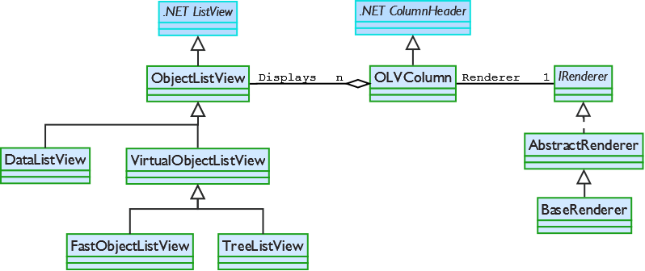
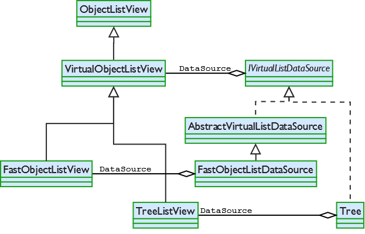

.. -*- coding: UTF-8 -*-

:Subtitle: Just the FAQs, Ma'am

.. _faq:

Frequently Asked Questions
==========================

Some questions and issues surface regularly on the Forums or in emails. This section has
several of the most common questions. Please read the questions before asking questions on
the Forum. Several people have been known to have blood pressure problems.

Can an ObjectListView have rows of different heights?
-----------------------------------------------------

No.

ObjectListView is a wrapper for the underlying ListView. It makes a ListView much easier
to use, but it can't change the control's basic behaviour. One limitation of a ListView is
it that cannot have rows of different heights. There is no way to make one row be taller
than other rows. It's just not possible.

If being able to have rows of different heights is essential to you,
ObjectListView is not your solution. You may want
to consider Matthew Hall's excellent XPTable_ and its `update project`_, as well as
Lee Paul Alexander's fantastic `Outlook-style list`__.

.. _XPTable: http://www.codeproject.com/KB/list/XPTable.aspx

.. _update project: http://www.codeproject.com/KB/list/XPTableListViewUpdate.aspx

.. __: http://www.codeproject.com/KB/list/outlooklistcontrol.aspx

Can I use ObjectListView in a commercial application?
-----------------------------------------------------

The code on SourceForge is released under GPLv3. The GPL is a viral license,
meaning that if you use some GPL-covered code in your application, your
application must also be covered by GPL. This is generally not what commercial
developers want. (I am not a lawyer. This is not legal advice. It could be
completely wrong).

However, if you wish to use this code in a commercial application, please
contact me: phillip_piper@bigfoot.com .

Why doesn't the ObjectListView auto-update when I change my model objects?
--------------------------------------------------------------------------

    *I have ObjectListView that's showing my model objects. But when I change the values in my
    model, the ObjectListView doesn't update. What's going wrong here?*

Nothing. That's what it is supposed to do.

The `ObjectListView` knows nothing about your model objects. It does not
know when they have been changed. Only you know that. When you know that a model object
has changed and needs to be updated, you can either call `RefreshObject()` to
update just one object, or you can call `RepopulateList()` to rebuild everything at once.

`DataListView` is the exception to this rule. Any change you make to your `DataSource` should be
immediately reflected in the `DataListView`.

Don't you have some class diagrams for all this stuff?
------------------------------------------------------

     *There seems to be an awful lot going on here. Don't you have some class
     diagram so I can see how things fit together?*

Some people love class diagrams. Other regard them as just one more piece of out
of date documentation. As of v2.1, these diagrams are accurate.

The basic classes are show here:

More details about the relationship between virtual listviews and their data sources
can be seen in this diagram:

Why doesn't it do *some-feature-I-really-want*?
-----------------------------------------------

It could be that I simply haven't thought of it. Or it could be that I have thought of
it but it just isn't possible.

Remember that `ObjectListView` is just a wrapper around `ListView`. It makes the `ListView`
a little easier to use, and adds some helper functions, but it can't change the basic
behaviour of the control.

Why is the text of the first column indented by about 20 pixels?
----------------------------------------------------------------

This shows up when you have a `ListView` that doesn't have an icon in the first column.
The control still leaves space for the icon, even when there isn't one.

If the `ListView` doesn't have a small image list, this indent disappears. But as soon as
the control has a small image list, even an empty one, the text of the first column will
be indented.

So, if you really want to get rid of this indent, make an ObjectListView which doesn't have
a `SmalImageList`. Be aware that some feature *require* a small image list and will create
one if necessary. These features are:

   * sort indicators on column header on pre-XP systems
   * subitem checkboxes

I've compiled the project for the first time, but I don't see the ObjectListView in the toolbox
-----------------------------------------------------------------------------------------------

If you are using Visual Studio, check under the Tools>>Options, in the Windows
Form Designer category (turn on Advanced settings to see) for a setting
"AutoToolboxPopulate." This should be set to True.

Also, make sure you have a Windows Forms project. ObjectListView is a Windows
Forms control: it will not appear in the toolbox for a Windows Presentation
Framework project, nor for a WebForms project.

Is ObjectListView thread-safe?
------------------------------

"Thread-safe" is a notoriously slippery term.

If you mean, "Can I do whatever I like with an ObjectListView from various
threads at the same time?" the answer is "Probably not."

If you mean "Can I update the ObjectListView from a background thread?" then the
answer is, "Yes, so long as you stick to the primary commands." Specially, these
methods can all be called from background threads, and the control will work as
expected:

* `SetObjects()`
* `ClearObjects()`
* `RefreshObjects()`
* `Sort()`

Does it work with Mono?
-----------------------

Yes. Maybe. Depends.

Some of the tricks of the ObjectListView depend on manipulating the underlying
Windows ListView control. Obviously, these tricks will not work on Mono.

However, the code should compile and run on Mono. You will need to define the
conditional compilation symbol MONO in your project.

I have tested the ObjectListView under Ubuntu and it works as expected, albeit
without some functionality. I have also tested it with the Windows version of
Mono, and it still works, though it is not pretty. I have no access to a Mac or
to other versions of Un*x, so I would be interested in hearing people's
experiences on these operating systems.

Please don't ask me Mono questions. You will have to look elsewhere for Mono
expertise.
