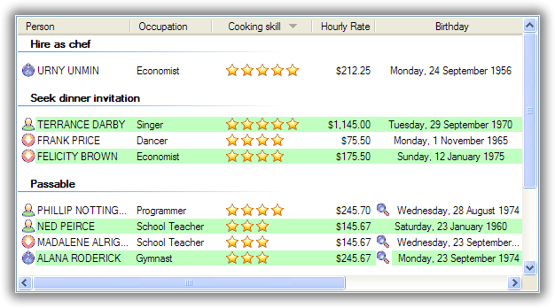
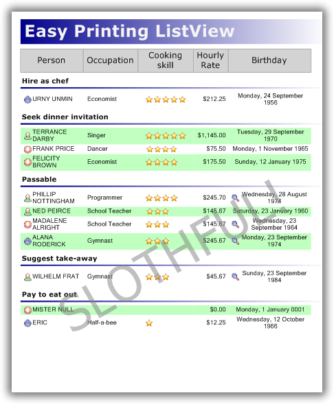

.. -*- coding: UTF-8 -*-

:Subtitle: How I learned to stop worrying and love .NET ListView

==============
ObjectListView
==============

.. rubric:: ObjectListView is a C# wrapper around a .NET ListView. It makes the ListView
            much easier to use and provides some neat extra functionality.

Larry Wall, the author of Perl, once wrote that the three essential character flaws of any
good programmer were sloth, impatience and hubris. Good programmers want to do the minimum
amount of work (sloth). They want their programs to run quickly (impatience). They take
inordinate pride in what they have written (hubris).

ObjectListView encourages the vices of sloth and hubris, by allowing programmers to do far
less work but still produce great looking results.

I'm too impatient! Just show me what it can do!
-----------------------------------------------

Here is an example of what your ListView can look like with a few callbacks in place:

The TreeListView similarly make a tree structure look beautiful:

.. image:: images/treelistview.png

And this is the report that can be effortlessly produced from the ObjectListView:

Without wasting my time, just tell me what it does!
---------------------------------------------------

OK, here's the bullet point feature list:

* Automatically transforms a list of model objects into a fully functional ListView, including automatically sorting and grouping rows.
* Supports :ref:`owner drawing <owner-draw-label>`, including rendering animated graphics and images stored in a database.
* Easily :ref:`edit the cell values <cell-editing-label>`.
* Easily enable :ref:`drag and drop <dragdrop-label>`.
* Supports all ListView views (report, list, large and small icons).
* Supports automatic grouping.
* Supports collapsible groups (Vista only).
* Columns can be fixed-width, have a minimum and/or maximum width, or be space-filling (:ref:`Column Widths <recipe-column-width>`)
* Displays a :ref:`"list is empty" message <recipe-emptymsg>` when the list is empty (obviously).
* Supports :ref:`tooltips <recipe-tooltips>` for cells and for headers
* Supports :ref:`checkboxes in any column <recipe-checkbox>` as well as tri-state checkboxes
* Supports alternate rows background colors.
* Supports :ref:`custom formatting of rows <recipe-formatter>`.
* Supports :ref:`searching (by typing) on any column <recipe-search>`
* Supports :ref:`image and text overlays <recipe-overlays>`
* The `DataListView` version supports data binding.
* The `FastObjectListView` version can build a list of 10,000 objects in less than 0.1 seconds.
* The `VirtualObjectListView` version supports millions of rows through ListView's virtual mode.
* The `TreeListView` version combines an expandable tree structure with the columns of a ListView.

Seriously, after using an `ObjectListView`, you will never go back to using a plain `ListView`.

OK, I'm interested. What do I do next?
--------------------------------------

The source code to `ObjectListView` can be `downloaded here <download.html>`_. You
can also download a demonstration, documentation and unit tests on the same page.

After that, you might want to look at the :ref:`Getting Started` and the
:ref:`Cookbook` sections. Please make sure you have read and understood these
sections before asking questions in the Forum_. There is also an article
describing the `ObjectListView at CodeProject`_.

At some point, you will want to do something with an ObjectListView and it won't
be immediately obvious how to make it happen. After dutifully scouring the
:ref:`Getting Started` and the :ref:`Cookbook` sections, you decide that is is
still not obvious. The Forum_ section is the place to find all your as-yet-
unasked questions.

It may even be possible that you might find some undocumented features in the
code (also known as bugs). These "features" can be `reported here`_ and can be
tracked on the project's `Issue Tracker`_.

If you would like to ask me a question or suggest an improvement, you can contact me here:
phillip_piper@bigfoot.com.

.. _ObjectListView at CodeProject: http://www.codeproject.com/KB/list/ObjectListView.aspx

.. _Forum: https://sourceforge.net/project/platformdownload.php?group_id=225207

.. _reported here: https://sourceforge.net/tracker/?func=add&group_id=225207&atid=1064157

.. _Issue Tracker: https://sourceforge.net/tracker/?group_id=225207&atid=1064157

Technical details
-----------------

I've started keeping a :ref:`technical blog <blog>` documenting some of the efforts that were required to
solve some of the problem encountered within the ObjectListView.

* Surely :ref:`a little bug <blog-subitemboundsbug>` can't cause too much trouble?

* :ref:`This long article <blog-overlays>` talks about the problems and solutions encountered when developing the
  overlay feature of v2.2.

* :ref:`This article <blog-tooltip>` talks about the problems of trying to use a standard `ToolTip` class on a
  `ListView`.

What people have said about ObjectListView
------------------------------------------

When thinking about using some new code, it's always interesting to hear what others have said about it.

.. pull-quote:: I have been watching this control since 2007 and just checked the new features you've added recently and in the last couple of months. This has gotta be the best list control out there. You've done a brilliant job with this and I'm sure many others appreciate your work. Well done and keep it up!

   -- `Hakan <http://www.codeproject.com/Messages/3034884/feedback-about-this-control.aspx>`_

.. pull-quote:: I second that. This should be brought into the next version of the framework, it's brillant work!

   -- `id2008 <http://www.codeproject.com/Messages/3034969/Re-feedback-about-this-control.aspx>`_

.. pull-quote:: Superb job. Thanks for sharing this fantastic control.

   -- `Hamed Mosavi <http://www.codeproject.com/Messages/3018693/Superb-job.aspx>`_

.. pull-quote:: Never think your work goes unappreciated. This is the best project on CodeProject, by far.

   -- `dyster_ <http://www.codeproject.com/Messages/3136396/hypocrite.aspx>`_

.. pull-quote:: ObjectListView has got to be one of the slickest controls out there - simple, quick and powerful.

   -- `jake <http://www.riggshill.com/home/node/23>`_

.. pull-quote:: I'm using ObjectListView since one year now and it's certainly one of the best ListView control I know.

  -- `Lionel Schiepers <http://www.codeproject.com/Messages/2937357/unsafe.aspx>`_

.. pull-quote:: I wanted to say that your control, your code, and your support on the forums, has been one of the best experiences I have had with working with someone elses' product. Great job man, and very nice programming.

   -- Mike Coffey (in personal email)

.. pull-quote:: Thanks for this control, which I now use everywhere I can! It works great.

   -- `William Sauron <http://www.codeproject.com/script/Forums/View.aspx?fid=350107&msg=2713269>`_

.. pull-quote:: Intelligent and Intuitive. Thanks.

   -- `Mike Hankey (4th Marines HQ) <http://www.codeproject.com/script/Forums/View.aspx?fid=350107&msg=2733497>`_

.. pull-quote:: One of the guys over at the MSDN magazine is known as the Datagrid (ASP.Net) whisperer. You must be the Listview whisperer. DAMN! This is a sexy bunch of controls!

   -- `Jonathan C Dickinson <http://www.codeproject.com/script/Forums/View.aspx?fid=350107&msg=2594655>`_

.. pull-quote:: What can I say? I have a file verification program, and I just replaced the listview with yours, and 150 lines of code was made obsolete, and very few lines were added, it also improved performance massively. The light shine upon you, MS should send you some sort of gift for removing the largest headache .NET ever contrived.

   -- `Johan Sonesson <http://www.codeproject.com/script/Forums/View.aspx?fid=350107&msg=2536977>`_

.. pull-quote:: I've got to say, your code is amazing. It's the only time in my life that I've looked at code and thought it was better than mine. Thanks for your great work (on many levels) and for sharing it.

   -- Brian Perrin (in personal email)

.. pull-quote:: I think you should rename the control description to: "A ListView on Steroids". Keep up the excellent work.

   -- `Michael (mpgjunky) <http://www.codeproject.com/script/Forums/View.aspx?fid=350107&msg=2734381>`_

.. pull-quote:: Nice features added, especially the fast build speed and hidden columns, keep up the good work on this control! well done.

   -- `cinamon <http://www.codeproject.com/script/Forums/View.aspx?fid=350107&msg=2416400>`_

.. pull-quote:: A VERY BIG "Thank you" for this wonderful control - it's easy to handle once you got the idea, very good structured coding, just a jewel. It became soon one of my favourites.

   -- `Metze <http://www.codeproject.com/script/Forums/View.aspx?fid=350107&msg=2357723>`_

.. pull-quote:: Great control. This solves a lot of problems. Thank you very much

   -- `merlin981 <http://www.codeproject.com/script/Forums/View.aspx?fid=350107&msg=2290090>`_

.. pull-quote:: Thanks for a GREAT control, and also for your help

   -- `doncp <http://www.codeproject.com/script/Forums/View.aspx?fid=350107&msg=2178944>`_

.. pull-quote:: I use this control in almost every project now.. amazing job. Thanks!

   -- `Chris Micali <http://www.codeproject.com/script/Forums/View.aspx?fid=350107&msg=2253750>`_

.. pull-quote:: I've never posted before but this is so good, that I must say something... This is awesome!! Keep the good work!

   -- `OverlordHammer <http://www.codeproject.com/script/Forums/View.aspx?fid=350107&msg=1996170>`_

.. pull-quote:: Thank you for opening your hard work to the community, it saved me hours or coding plus I learnt a few new techniques from your code.

   -- `cliftonarms <http://www.codeproject.com/script/Forums/View.aspx?fid=350107&msg=1938806>`_

.. pull-quote:: Those years of experience and innate talent certainly show in this code; it's a pleasure to read. Thanks much for a great example.

   -- `Steve Shaffer <http://www.codeproject.com/script/Forums/View.aspx?fid=350107&msg=1717218>`_

.. pull-quote:: Very nice article and worthy of bookmarking

   -- `Paul Conrad <http://www.codeproject.com/script/Forums/View.aspx?fid=350107&msg=2653103>`_

.. pull-quote:: That's exactly what I have been finding for days. Thanks!!!

   -- `vcleak <http://www.codeproject.com/script/Forums/View.aspx?fid=350107&msg=1716837>`_

Site contents
-------------

.. toctree::
   :maxdepth: 1

   whatsnew
   features
   gettingStarted
   recipes
   Recipe - Cell Editing <cellEditing>
   Recipe - Owner Drawn <ownerDraw>
   Recipe - Drag and Drop <dragdrop>
   Recipe - Overlays <overlays>
   faq
   download
   Technical Blog <blog>
   changelog
