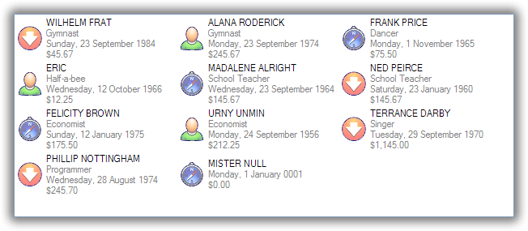

.. -*- coding: UTF-8 -*-

:Subtitle: (G)-rated techniques for loving the ListView

.. _cookbook-label:
.. _cookbook:

Learning to cook
================

.. container:: recipes

    :ref:`recipe-flavour`

    :ref:`recipe-editing`

    :ref:`recipe-sorting`

    :ref:`recipe-ownerdrawn`

    :ref:`recipe-column-width`

    :ref:`recipe-fixed-column`

    :ref:`recipe-column-filling`

    :ref:`recipe-formatter`

    :ref:`recipe-listviewprinter`

    :ref:`recipe-checkbox`

    :ref:`recipe-tileview`

    :ref:`recipe-emptymsg`

    :ref:`recipe-images-from-db`

    :ref:`recipe-typedobjectlistview`

    :ref:`recipe-treelistview`

    :ref:`recipe-search`

    :ref:`recipe-tooltips`

    :ref:`recipe-hottracking`

.. _recipe-flavour:

1. What flavour of ObjectListView do I want to use?
---------------------------------------------------

There are five flavours of ObjectListView:

ObjectListView - Plain Vanilla
^^^^^^^^^^^^^^^^^^^^^^^^^^^^^^

.. image:: images/icecream3.jpg
    :class: left-padded

*Stock standard, but still very nice*

A normal `ObjectListView` is capable of anything a `ListView` can do -- only in a much
easier to use package. Though it will handle a large number of rows, it is better
suited for smaller lists, that is, about 1000 rows or less.

If in doubt, start with this flavour. You can always change it to one of the others later on.

DataListView - Strawberry Smoothie
^^^^^^^^^^^^^^^^^^^^^^^^^^^^^^^^^^

.. image:: images/smoothie2.jpg
    :class: left-padded

*Everything is just smooth and easy*

A `DataListView` is for the ultra-slothful: those who literally do not want to even write one line of code.

A `DataListView` can be given a `DataSource` from within the IDE, and it will
automatically keep itself sync with that `DataSource`. Further, if the
`DataListView` is marked as editable, edits will be automatically written into the
`DataSource`.

VirtualObjectListView - Expresso
^^^^^^^^^^^^^^^^^^^^^^^^^^^^^^^^

.. image:: images/coffee.jpg
    :class: left-padded

*Has a slight bitter taste, but makes you capable of anything*

When you want to knock your users out with 10 million search results, a
`VirtualObjectListView` is for you. It can handle any number of objects.

But it does so at a cost:

* It cannot show groups.
* It cannot use Tile view.
* You have to implement the `IVirtualListDataSource` interface.

But for the cost of this "bitterness," you really can do anything.

FastObjectListView - Red Bull
^^^^^^^^^^^^^^^^^^^^^^^^^^^^^

.. image:: images/redbull.jpg
    :class: left-padded

*Also makes you capable of anything, but without the bitterness*

When you want speed, speed, and more speed, but you don't want the bitterness of the
`VirtualObjectListView`, a `FastObjectListView` is your weapon of choice.

It operates just like a normal `ObjectListView` -- only much faster.

Did I mention the speed?

TreeListView - Kaffa Lime Leaf
^^^^^^^^^^^^^^^^^^^^^^^^^^^^^^

.. image:: images/limeleaf.jpg
    :class: left-padded

*Adds a distinctive flavour*

If you have a tree structured data model, and you want to show common
information about the branches and the leaves of the structure, a `TreeListView`
is at your disposal.

See :ref:`recipe-treelistview` for more information.

.. _recipe-editing:

2. How do I let the user edit the values shown in the list?
-----------------------------------------------------------

This really needs a page to itself: :ref:`Cell Editing in an ObjectListView <cell-editing-label>`

.. _recipe-sorting:

3. How can I do some fancy sorting?
-----------------------------------

There are a couple of ways to change the standard sorting behavior:

* You can listen for the `BeforeSorting` event, do whatever you like, and then set
  `Cancelled` to true on the event so that no standard processing is done.

* If you are using an `ObjectListView` or a `DataListView`, you can install a
  `CustomSorter` delegate.

* If you are using a `VirtualObjectListView` (or one of its subclasses
  `FastObjectListView` or `TreeListView`), you cannot use the `CustomSorter`. You have
  to implement the `SortObjects()` method of the `IVirtualListDataSource`.

The `CustomSorter` delegates needs a little further explanation. This delegate
must install a `ListViewItemSorter` on the `ObjectListView`. This installed item
sorter will actually do the work of sorting the `ListViewItems`. See
`ColumnComparer` in the code for an example of what an item sorter has to do.

NOTE: This delegate does not sort the model objects themselves. Remember this
control knows nothing about your model objects, so sorting them makes no
difference to the control. You have to install the `ListViewItemSorter`.

So if you were using a normal `ObjectListView` to show a collection of medical
incidents, and you wanted to sort them so that the emergencies were always shown
first, you could install a delegate like this::

    this.incidentListView.CustomSorter = delegate(OLVColumn column, SortOrder order) {
        this.incidentListView.ListViewItemSorter = new ColumnComparer(
                this.isEmergencyColumn, SortOrder.Descending, column, order);
    };

This says, sort the items by the value in the "Is Emergency?" column first, and
secondarily by the column that the user just clicked on. Remember that the
`OLVColumn` given to the `ColumnComparer` does not have to an active column in the
control. You can create one just for the custom sorter. So, even if there was no
"Is Emergency?" column, you could still sort by the incidents so that
emergencies were shown first::

    this.incidentListView.CustomSorter = delegate(OLVColumn column, SortOrder order) {
        this.incidentListView.ListViewItemSorter = new ColumnComparer(
                new OLVColumn("ignored", "IsEmergency"), SortOrder.Descending, column, order);
    };

And if you were using a `VirtualObjectListView` to show a collection of 10 million
mailing addresses, and you wanted to sort them in some fashion, you would
implement the `SortObjects()` method of the `IVirtualListDataSource` like this::

    class MyMailingAddressesDataSource : AbstractVirtualListDataSource
    {
        ...
        override public void SortObjects(OLVColumn column, SortOrder order) {
            SortMailingAddressBy(column.AspectName, order);
        };
    };

No CustomSorter on FastObjectListView
^^^^^^^^^^^^^^^^^^^^^^^^^^^^^^^^^^^^^

One incompatibility between v1.x and v2.0 is that `FastObjectListViews` can no
longer have a `CustomSorter`. In v1.x it was possible, if tricky, to get a
`CustomSorter` to work with a `FastObjectListView`, but that is no longer possible
in v2.0 In v2.0, if you want to custom sort a `FastObjectListView`, you will have
to subclass `FastObjectListDataSource` and override the `SortObjects()` method, then
install that customized data source into your `FastObjectListView`::

    class MyCustomSortingDataSource : FastVirtualListDataSource
    {
        override public void SortObjects(OLVColumn column, SortOrder order) {
            // do some amazing sorting here
            this.RebuildIndexMap(); // you must call this otherwise the control will not work properly
        };
    };
    ...
    this.myFastObjectListView.DataSource = new MyCustomSortingDataSource(this.myFastObjectListView);

.. _recipe-ownerdrawn:

4. How can I draw the values in the cell's myself?
--------------------------------------------------

This needs a page to itself as well: :ref:`How to owner draw my values <owner-draw-label>`?

.. _recipe-column-width:

5. How can I stop the user from making a column too narrow or too wide?
-----------------------------------------------------------------------

Columns have both `MinimumWidth` and `MaximumWidth` properties. By default, these are -1,
which means that no limit is enforced. But if they are set to some other value, the column
will be limited to the given minimum or maximum width.

For example, this::

    this.titleColumn.MinimumWidth = 30

will stop the "Title" column from becoming less than 30 pixels in width. This is useful
for preventing users from shrinking columns to 0 width and then not being about to find
them again.

.. _recipe-fixed-column:

6. How can I stop the user from resizing a column?
--------------------------------------------------

There are some columns just don't make sense to be resizable. A column that
always shows a 16x16 status icon makes no sense to be resizable. To make a
column be fixed width and unresizable by the user, simply set both `MinimumWidth`
and `MaximumWidth` to be the same value.

.. _recipe-column-filling:

7. How can I make a column get bigger when the ObjectListView is made bigger?
-----------------------------------------------------------------------------

On most columns, the column's width is static, meaning that it doesn't change by
itself. But sometimes it would be useful if a column would resize itself to show
more (or less) of itself when the user changed the size of the ListView. For
example, the rightmost column of a personnel list might display "Comments" about
that person. When the window was made larger, it would be nice if that column
automatically expanded to show more of the comments about that person. You can
make this happen by setting the `IsSpaceFilling` property to `True` on that column.

An `ObjectListView` can have more than one space filling column, and they
generally share the available space equally between them (see the
`FreeSpaceProportion` property to change this).

You should be aware that as the `ObjectListView` becomes smaller, the space
filling columns will become smaller too, until they eventually disappear (have
zero width). The `MinimumWidth` and `MaximumWidth` properties still work for space
filling columns. So you can use the `MinimumWidth` property to make sure that a
space filling column doesn't disappear.

.. _recipe-formatter:

8. How can I change the colours of a row?
-----------------------------------------

You install a `RowFormatter` delegate. A `RowFormatter` delegate is called after a
`OLVListItem` has been completely filled in, but before it is added to the
`ObjectListView`. It can change the formatting of the list item, or any of its
other properties.

To show customers in red when they owe money, you could do this::

    this.customerListView.RowFormatter = delegate(OLVListItem olvi) {
        Customer customer = (Customer)olvi.RowObject;
        if (customer.Credit < 0)
            olvi.ForeColor = Color.Red;
    };

You can format sub-items too, but it is a little more involved. There is no
separated callback for individual sub-items. So the `RowFormatter` can be written
to format sub-items too.

So, if in our above example, we only want to make the actual credit balance to
be red, not the whole row, the `RowFormatter` would look like this::

    this.customerListView.RowFormatter = delegate(OLVListItem olvi) {
        Customer customer = (Customer)olvi.RowObject;
        if (customer.Credit < 0) {
            int i = this.customerListView.Columns.IndexOf(this.creditColumn);
            if (i >= 0) {
               olvi.UseItemStyleForSubItems = false;
               olvi.SubItems[i].ForeColor = Color.Red;
            }
        }
    };

This code doesn't assume a position for the credit column but finds it each
time. This is conservative and it could be replaced with a constant -- if you
can guarantee that no other fool is going to move or remove it :-)

The other important thing to note is the *olvi.UseItemStyleForSubItems = false*.
By default, all subitems have the same formatting as the listitem itself. To
indicate that you want subitems have their own formatting, you must set
`UseItemStyleForSubItems` to `False`.

.. _recipe-listviewprinter:

9. How can I make my ObjectListView into a shiny report?
--------------------------------------------------------

You make a `ListViewReporter` object in your IDE, and you set the `ListView`
property to be the `ObjectListView` you want to print.

There is a whole article available on CodeProject explaining in detail how to do
this: `Turning a ListView into a nice report`_. Read the article and play with demo
to see how it works.

.. _Turning a ListView into a nice report: http://www.codeproject.com/KB/miscctrl/ListViewPrinter.aspx

.. _recipe-checkbox:

10. How do I use checkboxes in my ObjectListView?
-------------------------------------------------

To uses checkboxes with an ObjectListView, you must set the `CheckBoxes` property
to `True`. If you want the user to be able to give check boxes the Indeterminate value,
you should set the `TriStateCheckBoxes` property to `True`.

To make the checkboxes work, you can do:

1. Do nothing else

With just `CheckBoxes` set to `True`, the check boxes act as a more durable form
of selection. You can find the objects that are checked via the `CheckObjects`
property, and you can change which rows are checked by setting the same
property.

2. Using CheckedAspectName

If your check box reflects data from your model, `CheckedAspectName` is the next possibility.

Specifically, if your model object already has a property that directly matches whether or
not a row should be checked, a `CheckedAspectName` is the simplest approach.
Simply set the `CheckedAspectName` to the name of your property, and the
`ObjectListView` will handle everything else, both the getting and the setting of
this property's value. The property must be a `boolean` property.

3. Using delegates

If `CheckedAspectName` is too simple for your needs, you can install
`CheckStateGetter` and `CheckStatePutter` delegates. The first delegate is used to
decide if the checkbox on the row that is showing the given model object should
be checked or unchecked. The second is called when the user clicked the check
box.

There are two flavour of check state getter/putters: there are `CheckStateGetter`
and `CheckStatePutter` delegates which deal with `CheckStates`; and there are
`BooleanCheckStateGetter` and `BooleanCheckStatePutter` delegates which deal only
with `booleans`. If you are only interested in checkboxes being on or off, the
boolean versions are what you want. However, if you want to deal with
indeterminate values too, you must use the `CheckState` versions::

    this.objectListView1.BooleanCheckStateGetter = delegate(Object rowObject) {
        return ((Person)rowObject).IsActive;
    };

    this.objectListView1.BooleanCheckStatePutter = delegate(Object rowObject, bool newValue) {
        ((Person)rowObject).IsActive = newValue;
        return newValue; // return the value that you want the control to use
    };

Note that the `CheckStatePutter` returns the value that will actually be used.
This doesn't have to be the same as the value that was given. So your delegate
can refuse to accept the checking of a particular model if it wants.

Sub-item checkboxes
^^^^^^^^^^^^^^^^^^^

As of v2.1, `ObjectListViews` support a limited form of checkboxes on subitems.
The `ObjectListView` can draw a checkbox in a cell, but not the text to the right of the box.
To enable this, `UseSubItemCheckBoxes` must be set to true.

If `CheckBoxes` is True on a column, the aspect for that column will be
interpreted as a boolean value and a check box will be displayed to represent
that value. If the `ObjectListView` is owner drawn, the check box will be aligned
following the column `Alignment`, but in standard mode, the check box will always
be to the far left.

If `TriStateCheckBoxes` is True, the user will be able to set the check box to have
the `Indeterminate` value.

If you use tri state checkboxes on subitems, your model must be able to handle the third
state. This means your data must be either a `bool?` or a `CheckState`. If you have a simple
boolean field, setting `TriStateCheckBoxes` is pointless since your data cannot handle
the Indeterminate state (`null` in this case).

Setting either `CheckBoxes` or `TriStateCheckBoxes` on column 0 does nothing since
the check box on column 0 is the checkbox for the whole row. It is controlled by
settings on the `ObjectListView` itself.

CheckBoxes and virtual lists
^^^^^^^^^^^^^^^^^^^^^^^^^^^^

The .NET `ListView` cannot have `CheckBoxes` cannot on virtual lists. But, as of
v1.13 (July 2008), I have changed `VirtualObjectListView` (and thus
`FastObjectListView` and `TreeListView`) so it can support checkboxes. So now all
flavours of `ObjectListView` support checkboxes equally.

The only caveat for using check boxes on virtual lists is that, when a
`CheckStateGetter` is installed, the control has to iterate the entire list when
the `CheckedObjects` property is read. Without a `CheckStateGetter`, the control
assumes that nothing is checked until the user (or the programmer) explicitly
checks it. So it knows which objects have been checked and can simply return
them as the value of the `CheckedObjects` property. But when a `CheckStateGetter` is
installed, the only way the control can know whether an object is checked is by
calling the `CheckStateGetter` delegate. So to return the value of `CheckedObjects`
property, the control must iterate the whole list, asking in turn if this object
is checked. This is fine if the list has only 100 or even 1000 objects, but if
the list has 10,000,000 objects, your program is going to hang.

.. _recipe-tileview:

11. How do change the information that's displayed in Tile view?
----------------------------------------------------------------

The information that is shown when in Tile view is customisable. The primary
column has to appear, but the other "rows" are configurable. In the example
below, the Person's name appears, since that is the primary column, but the
"Occupation", "Birthdate", and "Hourly Rate" pieces of information are shown as
well.

To do this, set `IsTileViewColumn` to `True` for those columns that you want to
appear in the Tile view. Confusingly, a column in Detail view becomes a "row" in
a Tile view.

If you really want to change the information in the Tile view, you can custom
draw it! To do this, install an `ItemRenderer` on the list and
set `OwnerDraw` to `True`. See `BusinessCardRenderer` in the demo project for an
example implementation. To see that renderer in action, run the demo, switch to
the "Complex" tab, click the "Owner Drawn" checkbox, and switch to Tile view.

.. _recipe-emptymsg:

12. How do I change the message that's shown when the ObjectListView is empty?
------------------------------------------------------------------------------

When an ObjectListView is empty, it can display a "this list is empty" type message.

The `EmptyListMsg` is the property that holds the string that appears when an
`ObjectListView` is empty. This string is rendered using the `EmptyListMsgFont`::

    this.objectListView1.EmptyListMsg = "This database has no rows";
    this.objectListView1.EmptyListMsgFont = new Font("Tahoma", 24);

No, you can't owner draw it. Don't even think about it.

.. _recipe-images-from-db:

13. On the rows of my ObjectListView, I want to show images that come from a database. How do I do that?
--------------------------------------------------------------------------------------------------------

Normally, images that are shown on rows come from an `ImageList`. The `ImageGetter`
delegate simply returns the index of the image that should be drawn against the
cell. However, sometimes, the images that should be drawn are not known at
compile time. Or they are generated dynamically from some characteristic of the
model object being displayed. In such cases, the `ImageList` cannot be pre-
populated with the images to be used. But with a little planning, you can still
use your `ImageList` to manage your images, even when the `Images` are dynamically
retrieved.

First, give your `ObjectListView` an empty `SmallImageList` and an empty `LargeImageList`.

Secondly, install an `ImageGetter` delegate on your primary column that does something like this::

    this.mainColumn.ImageGetter = delegate(object row) {
        String key = this.GetImageKey(row);
        if (!this.listView.LargeImageList.Images.ContainsKey(key)) {
            Image smallImage = this.GetSmallImageFromStorage(key);
            Image largeImage = this.GetLargeImageFromStorage(key);
            this.listView.SmallImageList.Images.Add(key, smallImage);
            this.listView.LargeImageList.Images.Add(key, largeImage);
        }
        return key;
    };

This dynamically fetches the images if they haven't been already fetched. You
will need to write the `GetImageKey()`, `GetSmallImageFromStorage()` and
`GetLargeImageFromStorage()` methods. Their names will probably be different,
depending on exactly how you are deciding which image is shown against which
model object.

For example, if we were writing a File Explorer look-a-like, we might have something that looks like this::

    this.mainColumn.ImageGetter = delegate(object row) {
        File theFile = (File)row;
        String extension = this.GetFileExtension(theFile);
        if (!this.listView.LargeImageList.Images.ContainsKey(extension)) {
            Image smallImage = this.GetSmallIconForFileType(extension);
            Image largeImage = this.GetLargeIconForFileType(extension);
            this.listView.SmallImageList.Images.Add(extension, smallImage);
            this.listView.LargeImageList.Images.Add(extension, largeImage);
        }
        return key;
    };

If you only use Details view, you don't need to maintain the `LargeImageList`, but
if you use any other view, you must keep the `SmallImageList` and the
`LargeImageList` in sync.

.. _recipe-typedobjectlistview:

14. Isn't there are way to get rid of all the casts in the delegates?
---------------------------------------------------------------------

Yes. You can use a `TypedObjectListView` wrapper.

One annoyance with `ObjectListView` is all the casting that is needed. Because the
`ObjectListView` makes no assumptions about what sort of model objects you will be
using, it handles all models as objects and it's up to you to cast them to the
right type when you need to. This leads to many delegates starting with a cast
like this::

    this.objectListView1.SomeDelegate = delegate(object x) {
        MyModelObject model = (MyModelObject)x;
        ...
    }

which becomes tiresome after a while. It would be nice if you could tell the
`ObjectListView` that it would always be displaying, say, Person objects.
Something like::

    this.objectListView1 = new ObjectListView<Person>();
    this.objectListView1.SomeDelegate = delegate(Person model) {
        ...
    }

Unfortunately, this is not possible, so we have a `TypedObjectListView` class
instead. This is not another `ObjectListView` subclass, but rather it's a typed
wrapper around an existing ObjectListView. To use one, you create an
`ObjectListView` within the IDE as normal. When it is time to implement your
delegates, you create a `TypedObjectListView` wrapper around your list view, and
declare your delegates against that wrapper. It's easier to use than it is to
explain, so look at this example::

    TypedObjectListView<Person> tlist = new TypedObjectListView<Person>(this.listViewSimple);
    tlist.BooleanCheckStateGetter = delegate(Person x) {
        return x.IsActive;
    };
    tlist.BooleanCheckStatePutter = delegate(Person x, bool newValue) {
        x.IsActive = newValue;
        return newValue;
    };

Look ma! No casts! The delegates are declared against the typed wrapper, which
does know what model objects are being used.

You can also use the `TypedObjectListView` for typed access to the delegates on your columns::

    tlist.GetColumn(0).AspectGetter = delegate(Person x) { return x.Name; };
    tlist.GetColumn(1).AspectGetter = delegate(Person x) { return x.Occupation; };

If you don't like referring to columns by their index, you can create
`TypedColumn` objects around a given `ColumnHeader` object::

    TypedColumn<Person> tcol = new TypedColumn<Person>(this.columnHeader16);
    tcol.AspectGetter = delegate(Person x) { return x.GetRate(); };
    tcol.AspectPutter = delegate(Person x, object newValue) { x.SetRate((double)newValue); };

Generating AspectGetters
^^^^^^^^^^^^^^^^^^^^^^^^

A side benefit of a `TypedObjectListView` is that it can automatically generate an
`AspectGetter` for a column from its `AspectName`. So, rather than hand-coding
`AspectGetters` like we have done above, you simply configure the `AspectName` in
the IDE, and then call `tlist.GenerateAspectGetters()`. This can (should?) handle
aspects of arbitrary complexity, like "Parent.HomeAddress.Phone.AreaCode".

.. _recipe-treelistview:

15. How do I use a TreeListView?
--------------------------------

A `TreeListView` shows a tree structure with its nice ability to expand and
collapse, but also shows information in columns.

Like all the other `ObjectListViews`, `TreeListView` relies on delegates. The
two essential delegates for using a `TreeListView` are:

* `CanExpandGetter` is used to decide if a given model can be expanded

* `ChildrenGetter` is used to gather the children that will appear under a given
  model after it is expanded. This delegate is only called if `CanExpandGetter` has
  returned true for that model object.

In the demo, there is an Explorer like example, which navigates the disks on the
local computer. The tree list view in that demo is configured like this::

    this.treeListView.CanExpandGetter = delegate(object x) {
        return (x is DirectoryInfo);
    };

This says that only directories can be expanded::

    this.treeListView.ChildrenGetter = delegate(object x) {
        DirectoryInfo dir = (DirectoryInfo)x;
        return new ArrayList(dir.GetFileSystemInfos());
    };

This second delegate gets the contents of a directory when that directory is
expanded. Remember, `ChildrenGetter` delegates are only ever called if
`CanExpandGetter` returns `True`, so this delegate knows that the parameter x must
be a `DirectoryInfo` instance.

Once you have these two delegates installed, you populate the control by setting
its `Roots` property. Roots are the top level branches of the tree. You can use the `Roots`
property to set these top branches, or you can call `SetObjects()`, which does
the same thing. To add or remove these top level
branches, you can call `AddObjects()` and `RemoveObjects()`, since in a tree view,
these operate on the top level branches.

The TreeListView caches the list of children under each branch. This is helpful
when the list of children is expensive to calculate. To force the `TreeListView`
to refetch the list of children, call `RefreshObject()` on the parent.

.. _recipe-search:

16. When the user types, I want to be able to match values in a column other than the first one. How can I do that?
-------------------------------------------------------------------------------------------------------------------

    I have a list that shows medical incidents. One of the columns is
    the doctor reponsible for that incident. I'd like the users to be able to sort
    by the "Doctor" column and then type the first few characters of the doctors
    name and find the cases assigned to that doctor. Is there a way to do that?

Surprisingly, yes! If you set `IsSearchOnSortColumn` to `True` (the default), then characters
typed into the list will be matched against the values of the sort column,
rather than against the values of column 0. iTunes shows this behavior when you
sort by the "Artist" or "Album" columns.

Remember: this searching works on the string representation of the value, rather than on the values themselves.

.. _recipe-tooltips:

17. How can I show more information in the tooltip when the mouse hovers over a cell?
-------------------------------------------------------------------------------------

The `ListView` default behavior is to only use tool tips to show truncated cell
values (even then only when `FullRowSelect` is `True`). But with an `ObjectListView`,
you are not so limited.

To show a different tooltip when the mouse is over a cell, you need to install a
delegate (no prizes for guessing that one). The tool tip for cells is controlled
by the `CellToolTipGetter` delegate. If this returns null, the tool tip behaves as
normal, but if it returns a string, that string will be shown while the mouse
hovers over that cell. Inserting "\r\n" sequences into the string gives a
multiline tool tip.

The example below shows a multiline tool tip only if the
Control key is held down::

    // Show a long tooltip over cells only when the control key is down
    this.olv.CellToolTipGetter = delegate(OLVColumn col, Object x) {
        if (Control.ModifierKeys == Keys.Control) {
            Song s = (Song)x;
            return String.Format("{0}\r\n{1}\r\n{2}", s.Title, s.Artist, s.Album);
        } else
            return null;
    };

Similarly, the column headers can show their own tool tips, this time via the
`HeaderToolTipGetter` delegate. Instead of installing a delegate, you can set
the `ToolTipText` property on a column. This is useful if the tool tips for the
column headers don't change. If you install a `HeaderToolTipGetter` delegate, it
takes precendence over the `ToolTipText` property, which will be ignored.

.. _recipe-hottracking:

18. How can I emphasise the row under the mouse?
------------------------------------------------

This is called "hot tracking." The normal `ListView` can underline the text of the
row under the mouse. `ObjectListView` can do much more.

Hot tracking is controlled by an instance of `HotTrackingStyle`. You create and
configure these in the IDE as non-visual components. Once you have created an
instance, you can assign it to the `HotTrackingStyle` property of the
`ObjectListView`. The same style instance can be shared between various
`ObjectListViews`, making it easier for your application to behave consistently.